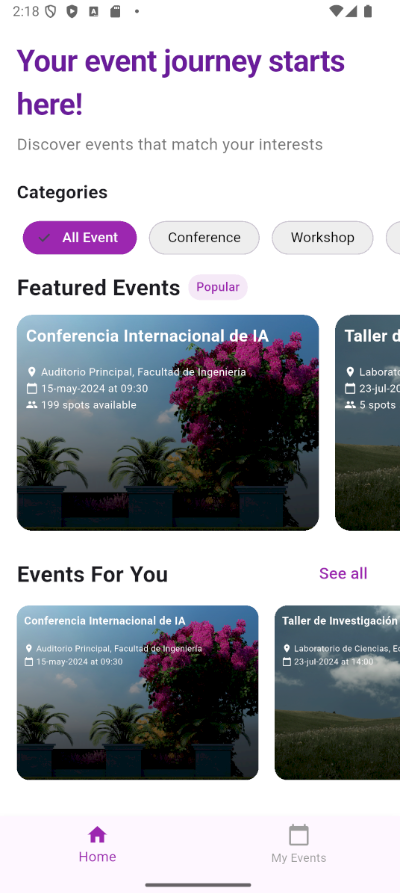
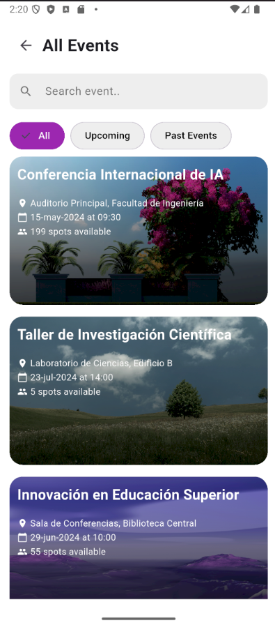
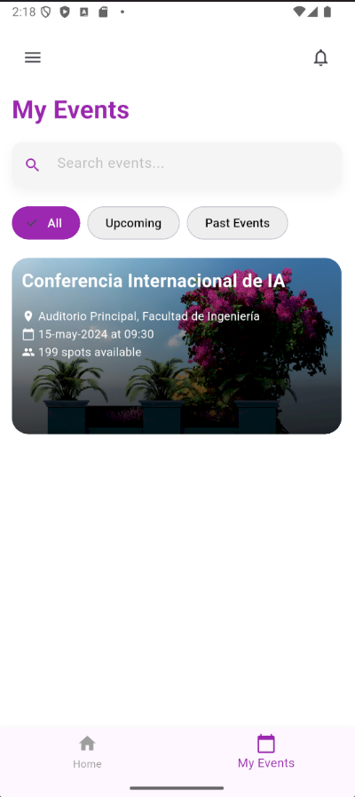
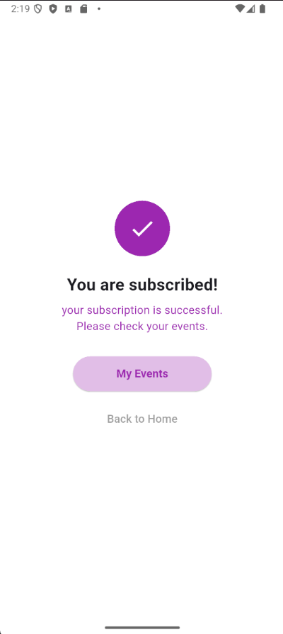
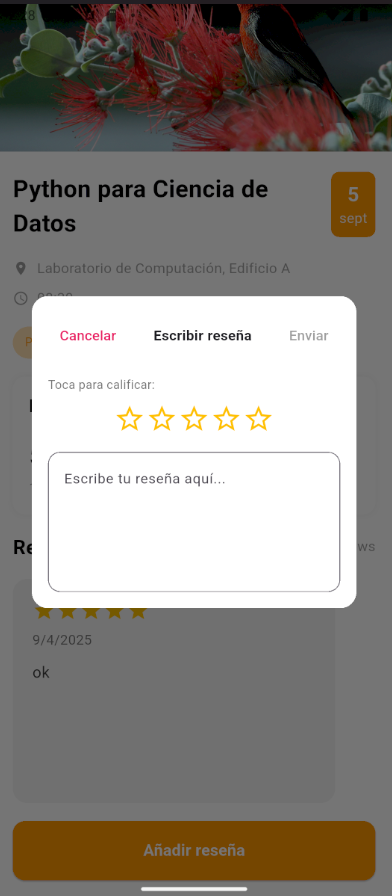

# 🎉 Event App


Una elegante aplicación móvil desarrollada con Flutter para descubrir, gestionar y participar en eventos.

## ✨ Características

- 🔍 **Explorar eventos**: Descubre eventos destacados y recomendados
- 🗂️ **Filtrar por categorías**: Conferencias, talleres, cursos e investigaciones
- 🔔 **Suscripciones**: Suscríbete a eventos para recibir actualizaciones
- ⭐ **Reseñas**: Califica y comenta sobre eventos pasados
- 🔍 **Búsqueda**: Encuentra eventos específicos con el buscador integrado

## 📱 Capturas de Pantalla

<div style="display: flex; justify-content: space-between;">
  <p align="center">
    
    
    
  </p>
</div>

<div style="display: flex; justify-content: space-between;">
  <p align="center">
    
    
    
  </p>
</div>

<div style="display: flex; justify-content: space-between;">
  <p align="center">
    
  </p>

## 🛠️ Tecnologías Utilizadas

- **Flutter**: Framework de UI para crear aplicaciones nativas multiplataforma
- **GetX**: Gestión de estado, navegación y dependencias
- **Dart**: Lenguaje de programación
- **Diseño Responsivo**: Adaptación a diferentes tamaños de pantalla

## 🚀 Empezando

### Prerrequisitos

- Flutter (última versión estable)
- Dart SDK
- Android Studio / VS Code
- Un emulador o dispositivo físico

### Instalación

1. Clona el repositorio:
   ```bash
   git clone https://github.com/tu-usuario/event_app.git
   ```

2. Navega al directorio del proyecto:
   ```bash
   cd event_app
   ```

3. Instala las dependencias:
   ```bash
   flutter pub get
   ```

4. Ejecuta la aplicación:
   ```bash
   flutter run
   ```

## 📊 Estructura del Proyecto

```
lib/
├── controllers/       # Controladores GetX
├── data/              # Fuentes de datos
├── models/            # Modelos de datos
├── pages/             # Pantallas de la aplicación
├── routes/            # Configuración de rutas
├── widgets/           # Widgets reutilizables
└── main.dart          # Punto de entrada
```

## DEMO
[YouTube Short](https://youtube.com/shorts/e71ZEjM_Uzc?feature=share)


